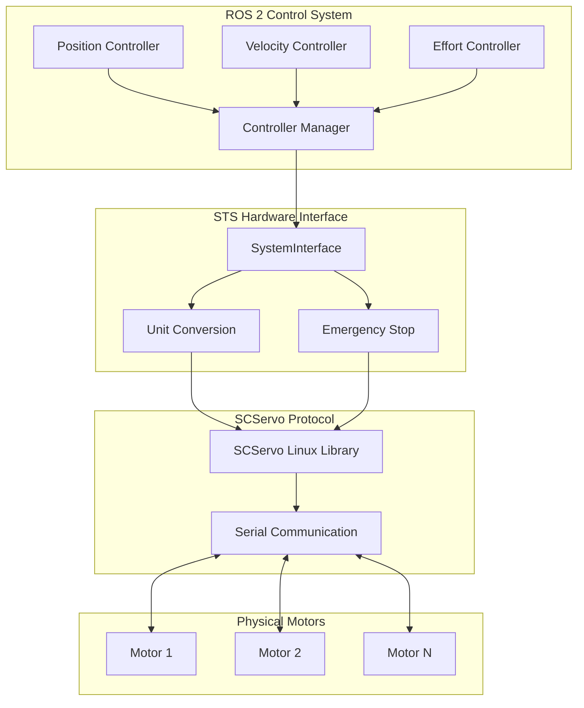

# STS Hardware Interface Architecture

System design and implementation details for the Feetech STS servo motor hardware interface.

## Overview

The STS Hardware Interface is a `ros2_control` SystemInterface plugin that bridges ROS 2 control systems with
Feetech STS series servo motors. It provides a unified interface for position, velocity, and effort control modes.

## Architecture Diagram



## Component Responsibilities

### SystemInterface Plugin

**File**: [sts_hardware_interface.cpp](../src/sts_hardware_interface.cpp)

Core `hardware_interface::SystemInterface` implementation:

- **on_init()**: Parse URDF parameters and validate configuration
- **on_configure()**: Initialize serial communication and verify motors
- **on_activate()**: Set operating modes, enable torque, and read initial states
- **on_deactivate()**: Disable motor torque and stop all motion
- **on_cleanup()**: Close serial port and cleanup resources
- **on_shutdown()**: Emergency shutdown and resource cleanup
- **on_error()**: Handle error state with recovery attempts
- **read()**: Read motor states from hardware
- **write()**: Write motor commands to hardware

### Unit Conversion Layer

Converts between motor-native units and SI units:

| Function | Conversion |
|----------|-----------|
| `raw_position_to_radians()` | Motor steps (0-4095) → radians (0-2π) |
| `raw_velocity_to_rad_s()` | Motor velocity units → rad/s |
| `rad_s_to_raw_velocity()` | rad/s → motor velocity units |
| `radians_to_raw_position()` | radians → motor steps (0-4095) |

**Key Implementation**: Position inversion for direction control:

```cpp
// Invert motor direction by computing complement
int inverted_raw = STS_MAX_POSITION - raw_position;
return static_cast<double>(inverted_raw) * STEPS_TO_RAD;
```

### Emergency Stop System

Broadcast safety mechanism:

- **Broadcast Emergency Stop**:
  - Single `emergency_stop` command interface stops all motors simultaneously
  - Uses SCServo broadcast ID (0xFE) for hardware-level safety override
  - Stops all motors regardless of operating mode
  - Available at system level (not per-joint)

### Operating Mode Management

#### Mode 0: Position (Servo)

- Motor in servo mode (limited rotation)
- Accepts position, velocity (profile), acceleration commands
- Returns position, velocity, load feedback

#### Mode 1: Velocity (Wheel)

- Motor in wheel mode (continuous rotation)
- Accepts velocity, acceleration commands
- Returns position (odometry), velocity feedback
- No position limits

#### Mode 2: PWM (Effort)

- Direct PWM control
- Accepts effort (PWM value) commands
- Returns load (current) feedback
- For force/torque control applications

## Communication Protocol

### Serial Communication

- **Library**: SCServo Linux SDK (submodule)
- **Protocol**: Feetech STS/SCServo packet format
- **Baud Rate**: Configurable (default: 1000000)
- **Bus Topology**: Half-duplex RS485 or TTL serial

### Packet Types

| Operation | Packet Type | Use Case |
|-----------|------------|----------|
| Read | Single Read | Get individual motor state |
| Write | Single Write | Command individual motor |
| SyncWrite | Batch Write | Command multiple motors efficiently |
| Broadcast | Broadcast Write | Emergency stop all motors |

### SyncWrite Optimization

For multi-motor systems:

- Batches commands into single packet
- Reduces bus overhead
- Improves control loop timing
- Enabled by default (`use_sync_write: true`)

## State and Command Interfaces

### State Interfaces (Read from Hardware)

| Interface | Unit | Description |
|-----------|------|-------------|
| position | rad | Current joint angle |
| velocity | rad/s | Current angular velocity |
| load | % | Motor load (0-100%) |
| voltage | V | Supply voltage |
| temperature | °C | Motor temperature |
| current | mA | Motor current draw |

### Command Interfaces (Write to Hardware)

**Position Mode**:

- `position` (rad): Target angle
- `velocity` (rad/s): Profile velocity (optional)
- `acceleration` (rad/s²): Profile acceleration (optional)

**Velocity Mode**:

- `velocity` (rad/s): Target speed
- `acceleration` (rad/s²): Ramp rate (optional)

**PWM Mode**:

- `effort` (PWM units): Direct torque control

**System-Level**:

- `emergency_stop` (bool): Broadcast emergency stop (stops ALL motors)

## Safety Features

### Hardware Limits

Enforced at hardware interface level:

- `min_position` / `max_position`: Soft position limits
- `max_velocity`: Velocity limiting
- Motor firmware provides hard torque limits

### Error Recovery

- Serial communication timeout detection
- Automatic reconnection attempts
- Graceful degradation on partial failures
- State validation before commanding

### Mock Mode

Simulation support for testing without hardware:

- Enables `enable_mock_mode: true` parameter
- Simulates motor responses
- Useful for CI/CD and development

## Data Flow

### Read Cycle (Hardware → ROS 2)

1. Controller Manager calls `read()`
2. Hardware interface queries motors via serial
3. Raw motor data fetched (position, velocity, load, etc.)
4. Unit conversion: motor units → SI units
5. State interfaces populated
6. Controllers receive updated state

### Write Cycle (ROS 2 → Hardware)

1. Controllers write to command interfaces
2. Controller Manager calls `write()`
3. Hardware interface validates commands
4. Commands converted: SI units → motor units
5. Operating mode determines command type
6. SyncWrite batches commands (if multi-motor)
7. Serial packet transmitted to motors

## Performance Characteristics

- **Update Rate**: Typically 50-100 Hz (controller-dependent)
- **Communication Latency**: ~5-10 ms (serial + protocol overhead)
- **Position Resolution**: 4096 steps/revolution (0.09° per step)
- **Multi-Motor Overhead**: ~2 ms per additional motor (SyncWrite reduces this)

## Design Decisions

### Why ros2_control?

- **Standard**: Proven framework used across ROS 2 ecosystem
- **Composable**: Works with existing controllers (diff_drive, joint_trajectory, etc.)
- **Hardware Agnostic**: Controllers don't know about motor specifics
- **Well Tested**: Production-ready with extensive community usage

### Why Position Inversion?

Original design used per-joint `invert_direction` flag. Switched to global inversion:

- **Simplicity**: Single conversion function, no per-joint logic
- **Correctness**: Proper handling of 0-2π range
- **Performance**: Fewer conditional branches in hot path

### Why Mixed-Mode Operation?

Different motors on same bus can use different modes:

- **Flexibility**: One robot with servo arms + continuous wheels
- **Efficiency**: Single serial bus, single hardware interface
- **Simplicity**: One URDF, one controller manager instance

## Integration with ROS 2 Ecosystem

### Standard Controllers

Works with any `ros2_controllers` package controller:

- `joint_trajectory_controller` (arms, manipulators)
- `diff_drive_controller` (differential drive robots)
- `omni_wheel_drive_controller` (omnidirectional platforms)
- `forward_command_controller` (testing, direct control)

### Navigation Stack

Provides required interfaces for nav2:

- Velocity commands via controller
- Odometry via state interfaces
- TF transforms via robot description

### Diagnostics

State interfaces provide rich diagnostic data:

- Motor health (voltage, temperature, current)
- Load monitoring (detect stalls, jams)
- Performance metrics (velocity tracking accuracy)

## Extension Points

### Adding New Operating Modes

1. Define mode in URDF parameter
2. Add mode-specific command handling in `write()`
3. Implement motor configuration in `on_activate()`

### Custom State Interfaces

Add motor-specific state (e.g., internal errors):

1. Declare interface in `export_state_interfaces()`
2. Read motor data in `read()`
3. Populate interface value

### Custom Command Interfaces

Add motor-specific commands (e.g., PID tuning):

1. Declare interface in `export_command_interfaces()`
2. Handle command in `write()`
3. Send appropriate motor packet

## File Organization

```text
sts_hardware_interface/
├── include/sts_hardware_interface/
│   └── sts_hardware_interface.hpp      # Main interface class
├── src/
│   └── sts_hardware_interface.cpp      # Implementation
├── external/SCServo_Linux/             # Communication library (submodule)
├── config/                             # URDF and controller configs
├── launch/                             # Launch files
└── CMakeLists.txt                      # Build configuration
```

## Dependencies

- **ROS 2**: Controller interfaces, lifecycle management
- **ros2_control**: SystemInterface base class
- **SCServo Linux**: Feetech protocol implementation (submodule)
- **Standard C++17**: Core language features

## Further Reading

- [ros2_control Architecture](https://control.ros.org/master/doc/getting_started/getting_started.html)
- [SystemInterface API](https://control.ros.org/master/doc/api/hardware_interface/html/classhardware__interface_1_1SystemInterface.html)
- [Feetech STS Protocol](http://www.feetechrc.com/en/download.html)
