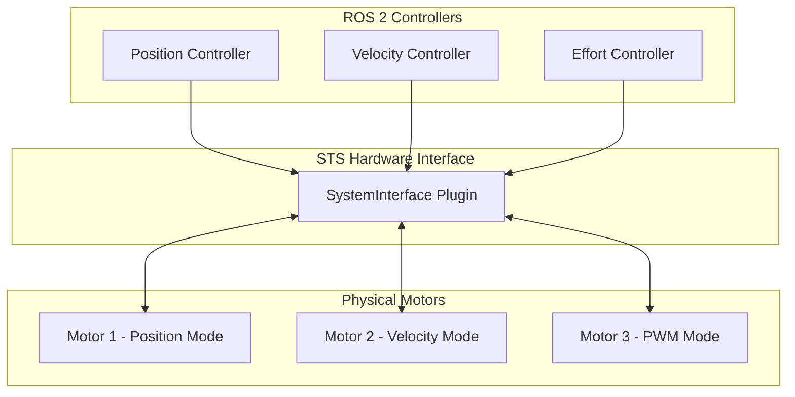

# STS Hardware Interface Architecture

System design and configuration guide for the Feetech STS servo motor hardware interface.

## Overview

The STS Hardware Interface is a `ros2_control` SystemInterface plugin that connects ROS 2 controllers to Feetech STS series servo motors. It provides position, velocity, and effort control modes with configurable parameters.

## System Architecture



## Operating Modes

| Mode | Use Case | Command Interfaces | Position Limits | Velocity Meaning |
|------|----------|-------------------|-----------------|-------------------|
| **0: Position** | Arm joints, precise positioning | position, velocity†, acceleration† | 0 to 2π radians (configurable) | Maximum speed during position move |
| **1: Velocity** | Wheels, continuous rotation | velocity, acceleration† | Unlimited | Target velocity for continuous rotation |
| **2: PWM/Effort** | Force control, grippers | effort (-1.0 to +1.0) | N/A | N/A |

† Optional interfaces

**Important:** The `velocity` command interface has different semantics depending on operating mode:

- **Mode 0 (Position)**: Velocity sets the maximum speed when moving to the commanded position
- **Mode 1 (Velocity)**: Velocity sets the target continuous rotation speed

**Example configuration:**

```xml
<!-- Mode 0: Position -->
<joint name="arm_joint">
  <param name="motor_id">1</param>
  <param name="operating_mode">0</param>
  <param name="min_position">0.0</param>
  <param name="max_position">6.283</param>
</joint>

<!-- Mode 1: Velocity -->
<joint name="wheel_joint">
  <param name="motor_id">2</param>
  <param name="operating_mode">1</param>
</joint>

<!-- Mode 2: PWM -->
<joint name="gripper_joint">
  <param name="motor_id">3</param>
  <param name="operating_mode">2</param>
</joint>
```

## State Interfaces

All modes always export the following state interfaces for every joint:

| Interface | Unit | Description |
|-----------|------|-------------|
| `position` | radians | Current joint angle |
| `velocity` | rad/s | Current angular velocity |
| `effort` | -100 to +100% | Motor load percentage |
| `voltage` | volts | Supply voltage |
| `temperature` | °C | Motor temperature |
| `current` | amperes | Motor current draw |
| `is_moving` | 0.0 or 1.0 | Motion status |

Note: All state interfaces are always exported regardless of URDF configuration.

### Accessing State Interfaces

The `joint_state_broadcaster` publishes motor state to two topics:

**Standard state (`/joint_states`):**

- Published as `sensor_msgs/JointState`
- Contains `position`, `velocity`, and `effort` fields
- Always available

**Additional state (`/dynamic_joint_states`):**

- Published as `control_msgs/DynamicJointState`
- Contains all other state interfaces (voltage, temperature, current, is_moving)
- Requires configuration in controller YAML:

```yaml
joint_state_broadcaster:
  ros__parameters:
    extra_joints:
      - wheel_joint
      - arm_joint
```

See [config/mixed_mode_controllers.yaml](../config/mixed_mode_controllers.yaml) for a complete example.

## Hardware Parameters

Configure these at the system level in your URDF:

| Parameter | Type | Default | Description |
|-----------|------|---------|-------------|
| `serial_port` | string | *required* | Serial port path (e.g., `/dev/ttyACM0`) |
| `baud_rate` | int | 1000000 | Communication baud rate (9600-1000000) |
| `communication_timeout_ms` | int | 100 | Serial communication timeout (1-1000 ms) |
| `use_sync_write` | bool | true | Batch commands for multiple motors |
| `enable_mock_mode` | bool | false | Simulation mode (no hardware required) |

## Joint Parameters

Configure these per joint:

| Parameter | Type | Default | Description |
|-----------|------|---------|-------------|
| `motor_id` | int | *required* | Motor ID on serial bus (1-253) |
| `operating_mode` | int | 1 | 0=Position, 1=Velocity, 2=PWM |
| `min_position` | double | 0.0 | Min position limit (radians, Mode 0 only) |
| `max_position` | double | 6.283 | Max position limit (2π radians, Mode 0 only) |
| `max_effort` | double | 1.0 | Max PWM duty cycle (Mode 2 only) |

## Unit Conversions

The STS motors use step-based units internally (4096 steps per revolution). The hardware interface converts between motor units and ROS 2 standard units (radians, rad/s):

- **Position:** 4096 steps = 2π radians (one full revolution)
  - Conversion: `radians = steps × (2π / 4096)`
  - **⚠️ Position Inversion:** Motor positions are inverted internally (raw 0 → 2π, raw 4095 → 0)
- **Velocity:** Maximum 3400 steps/s = 5.216 rad/s
  - Conversion: `rad/s = steps/s × (2π / 4096)`
  - **⚠️ Velocity Negation:** Positive rad/s commands → negative motor steps/s
- **Default max_velocity:** 3400 steps/s × (2π / 4096) ≈ 5.216 rad/s (hardcoded, not configurable)

### State Interface Scaling Factors

Additional state interfaces use the following scaling:

- **Voltage:** 0.1V per unit (raw 100 = 10.0V)
- **Current:** 6.5mA per unit (raw 100 = 0.65A)
- **Effort/Load:** 0.1% per unit (raw 500 = 50.0% load)

## Communication

- **Protocol:** Feetech STS/SCServo packet format
- **Bus type:** Half-duplex RS485 or TTL serial
- **Topology:** Daisy-chain (all motors on one bus, unique IDs 1-253)
- **Motor ID 254 (0xFE):** Reserved for broadcast commands
- **Baud rates:** 9600, 19200, 38400, 57600, 115200, 500000, 1000000 (default: 1000000)

### SyncWrite Benefits and Tradeoffs

**Enabled (`use_sync_write: true`, default):**

- **Benefit:** All motors receive commands in single packet (~5ms vs ~15ms for 3 motors)
- **Benefit:** Atomic updates - all motors commanded simultaneously
- **Tradeoff:** No per-motor error reporting (SyncWrite returns void)
- **Best for:** Multi-motor systems where timing synchronization matters

**Disabled (`use_sync_write: false`):**

- **Benefit:** Individual error detection per motor command
- **Tradeoff:** Higher latency (~5ms per motor)
- **Best for:** Single motor setups, debugging communication failures

## Additional Features

### Emergency Stop

Emergency stop is a **hardware-level command interface** that stops all motors simultaneously using broadcast ID 254.

**Activation:**

```bash
ros2 topic pub /sts_system/emergency_stop std_msgs/msg/Bool "data: true"
```

**Behavior:**

- Broadcasts stop command to ALL motors (broadcast ID 0xFE)
- Uses maximum deceleration (acceleration=254)
- Blocks all subsequent write commands until released
- State locked until explicit release

**Release:**

```bash
ros2 topic pub /sts_system/emergency_stop std_msgs/msg/Bool "data: false"
```

**Important:** Emergency stop is NOT per-joint - it affects all motors on the bus.

### Error Recovery

The hardware interface automatically recovers from communication failures:

**Automatic Recovery Trigger:**

- Activates after 5 consecutive read or write errors
- Attempts to reinitialize serial connection and all motors

**Recovery Process:**

1. Close serial port
2. Reopen serial connection
3. Ping all motors to verify presence
4. Reinitialize each motor with configured operating mode
5. Re-enable torque on all motors

**Recovery Failure:**

- If recovery fails, hardware interface transitions to ERROR state
- Manual intervention required (restart controller_manager)

### Mock Mode

Test without hardware by setting `enable_mock_mode: true` in hardware configuration.

**Mock Mode Simulation:**

- **Mode 0 (Position):** First-order position control with velocity limiting
- **Mode 1 (Velocity):** Direct velocity integration to position
- **Mode 2 (PWM):** PWM scaled to velocity (effort × 10.0)
- **Load simulation:** Based on velocity percentage (higher speed = higher load)
- **Motion detection:** `is_moving` threshold at 0.01 rad/s

Mock mode provides realistic behavior for controller development without hardware.

## ROS 2 Controller Compatibility

| Controller | Use Case | Compatible Modes |
|------------|----------|------------------|
| `JointTrajectoryController` | Arm manipulation | Mode 0 |
| `JointGroupVelocityController` | Wheels, continuous motion | Mode 1 |
| `JointGroupEffortController` | Force control, grippers | Mode 2 |
| `DiffDriveController` | Differential drive | Mode 1 |
| `ForwardCommandController` | Direct control, testing | All modes |

## Example Configurations

See [config/single_motor.urdf.xacro](../config/single_motor.urdf.xacro) and [config/mixed_mode.urdf.xacro](../config/mixed_mode.urdf.xacro) for complete examples.

## Troubleshooting

| Issue | Solutions |
|-------|-----------|
| **Motors not responding** | • Verify `serial_port` path and permissions<br>• Confirm `motor_id` matches physical motor<br>• Check `baud_rate` matches motor config<br>• Test with `enable_mock_mode: true` |
| **Position drift/jumps** | • Verify `min_position`/`max_position` range (default: 0 to 2π)<br>• Check position limits match mechanism |
| **Communication errors** | • Decrease controller `update_rate`<br>• Reduce number of state interfaces<br>• Test with single motor first<br>• Check cable quality and bus termination |

## Further Reading

- [Quick Start Guide](quick-start.md) - Setup and usage examples
- [ros2_control Documentation](https://control.ros.org/)
- [Feetech STS3215 Documentation](https://www.feetechrc.com/2020-05-13_56655.html)
