System design and implementation guide for the Feetech STS servo motor hardware interface.

## Overview

The STS Hardware Interface is a `ros2_control` SystemInterface plugin that connects ROS 2 controllers to Feetech STS series servo motors (STS3215 and compatible). It provides position, velocity, and effort control modes with full state feedback, safety features, and hardware-free simulation.

**Key Features:**

- **Scalable multi-motor support:** Control 1 to 253 motors on a single serial bus
- Three operating modes per motor (Position/Servo, Velocity, PWM/Effort)
- Mixed-mode operation on the same serial bus
- Efficient multi-motor coordination with SyncWrite
- Full 7-interface state feedback (position, velocity, effort, voltage, temperature, current, motion status)
- Hardware-level emergency stop
- Automatic error recovery
- Mock mode for hardware-free development

---

## System Architecture

<div align="center">
  
</div>

**Architecture Layers:**
1. **ROS 2 Controllers** - Standard ros2_control controllers (JointTrajectoryController, VelocityController, EffortController)
2. **Hardware Interface** - SystemInterface plugin bridging controllers to motor protocol
3. **Communication Layer** - SCServo protocol over RS485/TTL serial (half-duplex daisy-chain)
4. **Physical Motors** - Feetech STS series servo motors with unique IDs (1-253)

---

## Operating Modes

Each motor can be configured independently in one of three modes:

<style>
  .modes-table {
    transition: all 0.2s ease;
  }

  .modes-table:hover {
    transform: translateY(-2px);
    box-shadow: 0 6px 16px rgba(0,0,0,0.25) !important;
  }
</style>

<table class="modes-table" style="width: 100%; border-collapse: separate; border-spacing: 0; margin: 2em auto; border-radius: 8px; overflow: hidden; box-shadow: 0 4px 12px rgba(0,0,0,0.2); border: none;">
  <thead>
    <tr>
      <th colspan="5" style="text-align: center; padding: 0.6em; background: #f8f9fa; border: none;">🎛️  Operating Modes</th>
    </tr>
    <tr>
      <th style="text-align: left; padding: 0.6em; background: #e9ecef; border: none;">Mode</th>
      <th style="text-align: left; padding: 0.6em; background: #e9ecef; border: none;">Use Case</th>
      <th style="text-align: left; padding: 0.6em; background: #e9ecef; border: none;">Command Interfaces</th>
      <th style="text-align: left; padding: 0.6em; background: #e9ecef; border: none;">Position Limits</th>
      <th style="text-align: left; padding: 0.6em; background: #e9ecef; border: none;">Velocity Semantics</th>
    </tr>
  </thead>
  <tbody>
    <tr style="background: #ffffff;">
      <td style="padding: 0.6em; border: none;"><strong>0: Position</strong></td>
      <td style="padding: 0.6em; border: none;">Arm joints, precise positioning</td>
      <td style="padding: 0.6em; border: none;">position, velocity†, acceleration†</td>
      <td style="padding: 0.6em; border: none;">0 to 2π radians (configurable)</td>
      <td style="padding: 0.6em; border: none;">Maximum speed during position move</td>
    </tr>
    <tr style="background: #f0f0f0;">
      <td style="padding: 0.6em; border: none;"><strong>1: Velocity</strong></td>
      <td style="padding: 0.6em; border: none;">Wheels, continuous rotation</td>
      <td style="padding: 0.6em; border: none;">velocity, acceleration†</td>
      <td style="padding: 0.6em; border: none;">Unlimited</td>
      <td style="padding: 0.6em; border: none;">Target velocity for continuous rotation</td>
    </tr>
    <tr style="background: #ffffff;">
      <td style="padding: 0.6em; border: none;"><strong>2: PWM/Effort</strong></td>
      <td style="padding: 0.6em; border: none;">Force control, grippers</td>
      <td style="padding: 0.6em; border: none;">effort (-1.0 to +1.0)</td>
      <td style="padding: 0.6em; border: none;">N/A</td>
      <td style="padding: 0.6em; border: none;">N/A</td>
    </tr>
  </tbody>
</table>

† Optional interfaces

**Important:** The `velocity` command interface has different semantics depending on operating mode:
- **Mode 0 (Position)**: Sets the maximum speed when moving to the commanded position
- **Mode 1 (Velocity)**: Sets the target continuous rotation speed

**Configuration Example:**

```xml
<!-- Mode 0: Position/Servo -->
<joint name="arm_joint">
  <param name="motor_id">1</param>
  <param name="operating_mode">0</param>
  <param name="min_position">0.0</param>
  <param name="max_position">6.283</param>
</joint>

<!-- Mode 1: Velocity -->
<joint name="wheel_joint">
  <param name="motor_id">2</param>
  <param name="operating_mode">1</param>
</joint>

<!-- Mode 2: PWM/Effort -->
<joint name="gripper_joint">
  <param name="motor_id">3</param>
  <param name="operating_mode">2</param>
  <param name="max_effort">0.8</param>
</joint>
```

---

## State Interfaces

All modes always export the following state interfaces for every joint:

<table class="modes-table" style="width: 100%; border-collapse: separate; border-spacing: 0; margin: 2em auto; border-radius: 8px; overflow: hidden; box-shadow: 0 4px 12px rgba(0,0,0,0.2); border: none;">
  <thead>
    <tr>
      <th colspan="4" style="text-align: center; padding: 0.6em; background: #f8f9fa; border: none;">📊  State Interfaces</th>
    </tr>
    <tr>
      <th style="text-align: left; padding: 0.6em; background: #e9ecef; border: none;">Interface</th>
      <th style="text-align: left; padding: 0.6em; background: #e9ecef; border: none;">Unit</th>
      <th style="text-align: left; padding: 0.6em; background: #e9ecef; border: none;">Description</th>
      <th style="text-align: left; padding: 0.6em; background: #e9ecef; border: none;">Scaling Factor</th>
    </tr>
  </thead>
  <tbody>
    <tr style="background: #ffffff;">
      <td style="padding: 0.6em; border: none;"><code>position</code></td>
      <td style="padding: 0.6em; border: none;">radians</td>
      <td style="padding: 0.6em; border: none;">Current joint angle</td>
      <td style="padding: 0.6em; border: none;">4096 steps = 2π rad</td>
    </tr>
    <tr style="background: #f0f0f0;">
      <td style="padding: 0.6em; border: none;"><code>velocity</code></td>
      <td style="padding: 0.6em; border: none;">rad/s</td>
      <td style="padding: 0.6em; border: none;">Current angular velocity</td>
      <td style="padding: 0.6em; border: none;">3400 steps/s max ≈ 5.22 rad/s</td>
    </tr>
    <tr style="background: #ffffff;">
      <td style="padding: 0.6em; border: none;"><code>effort</code></td>
      <td style="padding: 0.6em; border: none;">-100 to +100%</td>
      <td style="padding: 0.6em; border: none;">Motor load percentage</td>
      <td style="padding: 0.6em; border: none;">0.1% per unit</td>
    </tr>
    <tr style="background: #f0f0f0;">
      <td style="padding: 0.6em; border: none;"><code>voltage</code></td>
      <td style="padding: 0.6em; border: none;">volts</td>
      <td style="padding: 0.6em; border: none;">Supply voltage</td>
      <td style="padding: 0.6em; border: none;">0.1V per unit</td>
    </tr>
    <tr style="background: #ffffff;">
      <td style="padding: 0.6em; border: none;"><code>temperature</code></td>
      <td style="padding: 0.6em; border: none;">°C</td>
      <td style="padding: 0.6em; border: none;">Motor temperature</td>
      <td style="padding: 0.6em; border: none;">Direct celsius</td>
    </tr>
    <tr style="background: #f0f0f0;">
      <td style="padding: 0.6em; border: none;"><code>current</code></td>
      <td style="padding: 0.6em; border: none;">amperes</td>
      <td style="padding: 0.6em; border: none;">Motor current draw</td>
      <td style="padding: 0.6em; border: none;">6.5mA per unit</td>
    </tr>
    <tr style="background: #ffffff;">
      <td style="padding: 0.6em; border: none;"><code>is_moving</code></td>
      <td style="padding: 0.6em; border: none;">0.0 or 1.0</td>
      <td style="padding: 0.6em; border: none;">Motion status (1.0=moving)</td>
      <td style="padding: 0.6em; border: none;">Boolean</td>
    </tr>
  </tbody>
</table>

**Note:** All state interfaces are always exported regardless of URDF configuration. URDF state interface declarations are optional but recommended for documentation purposes.

### Accessing State Interfaces

The `joint_state_broadcaster` publishes motor state to two topics:

**Standard state (`/joint_states`):**
- Message type: `sensor_msgs/JointState`
- Contains: `position`, `velocity`, and `effort` fields
- Always available without configuration

**Additional state (`/dynamic_joint_states`):**
- Message type: `control_msgs/DynamicJointState`
- Contains: `voltage`, `temperature`, `current`, `is_moving`
- Requires configuration in controller YAML:

```yaml
joint_state_broadcaster:
  ros__parameters:
    extra_joints:
      - wheel_joint
      - arm_joint
```

See [config/mixed_mode_controllers.yaml](../config/mixed_mode_controllers.yaml) for a complete example.

---

## Configuration Parameters

### Hardware Parameters

Configure these at the `<hardware>` level in your URDF:

<table class="modes-table" style="width: 100%; border-collapse: separate; border-spacing: 0; margin: 2em auto; border-radius: 8px; overflow: hidden; box-shadow: 0 4px 12px rgba(0,0,0,0.2); border: none;">
  <thead>
    <tr>
      <th colspan="5" style="text-align: center; padding: 0.6em; background: #f8f9fa; border: none;">⚙️  Hardware Parameters</th>
    </tr>
    <tr>
      <th style="text-align: left; padding: 0.6em; background: #e9ecef; border: none;">Parameter</th>
      <th style="text-align: left; padding: 0.6em; background: #e9ecef; border: none;">Type</th>
      <th style="text-align: left; padding: 0.6em; background: #e9ecef; border: none;">Default</th>
      <th style="text-align: left; padding: 0.6em; background: #e9ecef; border: none;">Range/Options</th>
      <th style="text-align: left; padding: 0.6em; background: #e9ecef; border: none;">Description</th>
    </tr>
  </thead>
  <tbody>
    <tr style="background: #ffffff;">
      <td style="padding: 0.6em; border: none;"><code>serial_port</code></td>
      <td style="padding: 0.6em; border: none;">string</td>
      <td style="padding: 0.6em; border: none;"><em>required</em></td>
      <td style="padding: 0.6em; border: none;">Valid path</td>
      <td style="padding: 0.6em; border: none;">Serial port path (e.g., <code>/dev/ttyACM0</code>)</td>
    </tr>
    <tr style="background: #f0f0f0;">
      <td style="padding: 0.6em; border: none;"><code>baud_rate</code></td>
      <td style="padding: 0.6em; border: none;">int</td>
      <td style="padding: 0.6em; border: none;">1000000</td>
      <td style="padding: 0.6em; border: none;">9600, 19200, 38400, 57600, 115200, 500000, 1000000</td>
      <td style="padding: 0.6em; border: none;">Communication baud rate</td>
    </tr>
    <tr style="background: #ffffff;">
      <td style="padding: 0.6em; border: none;"><code>communication_timeout_ms</code></td>
      <td style="padding: 0.6em; border: none;">int</td>
      <td style="padding: 0.6em; border: none;">100</td>
      <td style="padding: 0.6em; border: none;">1-1000</td>
      <td style="padding: 0.6em; border: none;">Serial communication timeout (ms)</td>
    </tr>
    <tr style="background: #f0f0f0;">
      <td style="padding: 0.6em; border: none;"><code>use_sync_write</code></td>
      <td style="padding: 0.6em; border: none;">bool</td>
      <td style="padding: 0.6em; border: none;">true</td>
      <td style="padding: 0.6em; border: none;">true/false</td>
      <td style="padding: 0.6em; border: none;">Batch commands for multiple motors</td>
    </tr>
    <tr style="background: #ffffff;">
      <td style="padding: 0.6em; border: none;"><code>enable_mock_mode</code></td>
      <td style="padding: 0.6em; border: none;">bool</td>
      <td style="padding: 0.6em; border: none;">false</td>
      <td style="padding: 0.6em; border: none;">true/false</td>
      <td style="padding: 0.6em; border: none;">Simulation mode (no hardware required)</td>
    </tr>
  </tbody>
</table>

### Joint Parameters

Configure these per `<joint>` in your URDF:

<table class="modes-table" style="width: 100%; border-collapse: separate; border-spacing: 0; margin: 2em auto; border-radius: 8px; overflow: hidden; box-shadow: 0 4px 12px rgba(0,0,0,0.2); border: none;">
  <thead>
    <tr>
      <th colspan="5" style="text-align: center; padding: 0.6em; background: #f8f9fa; border: none;">🔧  Joint Parameters</th>
    </tr>
    <tr>
      <th style="text-align: left; padding: 0.6em; background: #e9ecef; border: none;">Parameter</th>
      <th style="text-align: left; padding: 0.6em; background: #e9ecef; border: none;">Type</th>
      <th style="text-align: left; padding: 0.6em; background: #e9ecef; border: none;">Default</th>
      <th style="text-align: left; padding: 0.6em; background: #e9ecef; border: none;">Range</th>
      <th style="text-align: left; padding: 0.6em; background: #e9ecef; border: none;">Description</th>
    </tr>
  </thead>
  <tbody>
    <tr style="background: #ffffff;">
      <td style="padding: 0.6em; border: none;"><code>motor_id</code></td>
      <td style="padding: 0.6em; border: none;">int</td>
      <td style="padding: 0.6em; border: none;"><em>required</em></td>
      <td style="padding: 0.6em; border: none;">1-253</td>
      <td style="padding: 0.6em; border: none;">Motor ID on serial bus</td>
    </tr>
    <tr style="background: #f0f0f0;">
      <td style="padding: 0.6em; border: none;"><code>operating_mode</code></td>
      <td style="padding: 0.6em; border: none;">int</td>
      <td style="padding: 0.6em; border: none;">1</td>
      <td style="padding: 0.6em; border: none;">0, 1, 2</td>
      <td style="padding: 0.6em; border: none;">0=Position, 1=Velocity, 2=PWM</td>
    </tr>
    <tr style="background: #ffffff;">
      <td style="padding: 0.6em; border: none;"><code>min_position</code></td>
      <td style="padding: 0.6em; border: none;">double</td>
      <td style="padding: 0.6em; border: none;">0.0</td>
      <td style="padding: 0.6em; border: none;">any</td>
      <td style="padding: 0.6em; border: none;">Min position limit (radians, Mode 0 only)</td>
    </tr>
    <tr style="background: #f0f0f0;">
      <td style="padding: 0.6em; border: none;"><code>max_position</code></td>
      <td style="padding: 0.6em; border: none;">double</td>
      <td style="padding: 0.6em; border: none;">6.283</td>
      <td style="padding: 0.6em; border: none;">any</td>
      <td style="padding: 0.6em; border: none;">Max position limit (radians, Mode 0 only)</td>
    </tr>
    <tr style="background: #ffffff;">
      <td style="padding: 0.6em; border: none;"><code>max_velocity</code></td>
      <td style="padding: 0.6em; border: none;">double</td>
      <td style="padding: 0.6em; border: none;">5.22</td>
      <td style="padding: 0.6em; border: none;">any</td>
      <td style="padding: 0.6em; border: none;">Max velocity limit (rad/s, currently unused)</td>
    </tr>
    <tr style="background: #f0f0f0;">
      <td style="padding: 0.6em; border: none;"><code>max_effort</code></td>
      <td style="padding: 0.6em; border: none;">double</td>
      <td style="padding: 0.6em; border: none;">1.0</td>
      <td style="padding: 0.6em; border: none;">0.0-1.0</td>
      <td style="padding: 0.6em; border: none;">Max PWM duty cycle (Mode 2 only)</td>
    </tr>
  </tbody>
</table>

**Note:** `max_velocity` parameter is defined in the code but not currently parsed from URDF. The hardware uses a fixed maximum of 3400 steps/s (≈ 5.22 rad/s).

---

## Communication Protocol

### Serial Bus Configuration

- **Protocol:** Feetech STS/SCServo packet format
- **Bus type:** Half-duplex RS485 or TTL serial
- **Topology:** Daisy-chain (all motors on one bus)
- **Motor addressing:** Unique IDs from 1-253 (up to 253 motors per bus)
- **Broadcast ID:** 254 (0xFE) - Reserved for emergency stop commands affecting all motors
- **Baud rates:** 9600, 19200, 38400, 57600, 115200, 500000, 1000000 (default: 1000000)

**Scalability:** The hardware interface can manage an entire serial bus of motors, from a single motor to the maximum capacity of 253 motors. Each motor requires a unique ID (1-253), while ID 254 is reserved for broadcast commands that simultaneously affect all motors on the bus.

### SyncWrite Benefits and Tradeoffs

**Enabled (`use_sync_write: true`, default):**
- ✅ **Benefit:** All motors receive commands in single packet (~5ms vs ~15ms for 3 motors)
- ✅ **Benefit:** Atomic updates - all motors commanded simultaneously
- ⚠️ **Tradeoff:** No per-motor error reporting (SyncWrite returns void)
- **Best for:** Multi-motor systems where timing synchronization matters

**Disabled (`use_sync_write: false`):**
- ✅ **Benefit:** Individual error detection per motor command
- ⚠️ **Tradeoff:** Higher latency (~5ms per motor)
- **Best for:** Single motor setups, debugging communication failures

---

## Safety Features

### Emergency Stop

Emergency stop is a **hardware-level broadcast command** that stops all motors simultaneously using broadcast ID 254.

**Activation:**
```bash
ros2 topic pub /sts_system/emergency_stop std_msgs/msg/Bool "data: true"
```

**Behavior:**
1. Broadcasts stop command to ALL motors (ID 0xFE)
2. Uses maximum deceleration (acceleration=254)
3. Blocks all subsequent write commands until released
4. Emergency stop state persists until explicit release

**Release:**
```bash
ros2 topic pub /sts_system/emergency_stop std_msgs/msg/Bool "data: false"
```

**Important:** Emergency stop is NOT per-joint - it affects all motors on the bus simultaneously.

### Automatic Error Recovery

The hardware interface automatically recovers from communication failures:

**Recovery Trigger:**
- Activates after 5 consecutive read or write errors

**Recovery Process:**
1. Close serial port
2. Reopen serial connection
3. Ping all motors to verify presence
4. Reinitialize each motor with configured operating mode
5. Re-enable torque on all motors

**Recovery Failure:**
- If recovery fails, hardware interface transitions to ERROR state
- Manual intervention required (restart controller_manager or hardware interface)

---

## Mock Mode (Simulation)

Test controllers without hardware by setting `enable_mock_mode: true` in hardware configuration.

### Simulation Behavior

**Mode 0 (Position):**
- First-order position control with velocity limiting
- Simulates smooth approach to target position
- Respects commanded maximum velocity

**Mode 1 (Velocity):**
- Direct velocity integration to position
- Immediate velocity response

**Mode 2 (PWM/Effort):**
- PWM scaled to velocity (effort × 10.0 rad/s)
- Simplified torque-to-velocity model

**Additional Simulations:**
- **Load:** Based on velocity percentage (higher speed = higher load percentage)
- **Motion detection:** `is_moving` threshold at 0.01 rad/s
- **State variables:** Voltage, temperature, current remain at zero (not simulated)

Mock mode provides realistic command/state behavior for controller development without hardware.

---

## Unit Conversions

The STS motors use step-based units internally. The hardware interface converts between motor units and ROS 2 standard units:

### Position Conversion
- **Motor units:** 0-4095 steps (12-bit resolution)
- **ROS 2 units:** 0-2π radians (one full revolution)
- **Conversion:** `radians = steps × (2π / 4096)`
- **Note:** Position wraps at 2π (4096 steps)

### Velocity Conversion
- **Motor units:** ±3400 steps/s maximum
- **ROS 2 units:** ±5.22 rad/s maximum
- **Conversion:** `rad/s = steps/s × (2π / 4096)`

### Effort/Load Conversion
- **Motor units:** -1000 to +1000 (load percentage × 10)
- **ROS 2 units:** -100.0 to +100.0%
- **Conversion:** `percentage = load_raw × 0.1`

### Other State Conversions
- **Voltage:** `volts = raw × 0.1` (raw 100 = 10.0V)
- **Current:** `amperes = raw × 0.0065` (raw 100 = 0.65A)
- **Temperature:** Direct celsius value

---

## ROS 2 Controller Compatibility

This hardware interface is compatible with any ros2_control controller that uses the standard command and state interfaces. Below are common examples (non-exhaustive list):

<table class="modes-table" style="width: 100%; border-collapse: separate; border-spacing: 0; margin: 2em auto; border-radius: 8px; overflow: hidden; box-shadow: 0 4px 12px rgba(0,0,0,0.2); border: none;">
  <thead>
    <tr>
      <th colspan="4" style="text-align: center; padding: 0.6em; background: #f8f9fa; border: none;">🎮  ROS 2 Controller Compatibility</th>
    </tr>
    <tr>
      <th style="text-align: left; padding: 0.6em; background: #e9ecef; border: none;">Controller</th>
      <th style="text-align: left; padding: 0.6em; background: #e9ecef; border: none;">Package</th>
      <th style="text-align: left; padding: 0.6em; background: #e9ecef; border: none;">Use Case</th>
      <th style="text-align: left; padding: 0.6em; background: #e9ecef; border: none;">Compatible Modes</th>
    </tr>
  </thead>
  <tbody>
    <tr style="background: #ffffff;">
      <td style="padding: 0.6em; border: none;"><code>JointTrajectoryController</code></td>
      <td style="padding: 0.6em; border: none;">joint_trajectory_controller</td>
      <td style="padding: 0.6em; border: none;">Arm manipulation, precise positioning</td>
      <td style="padding: 0.6em; border: none;">Mode 0</td>
    </tr>
    <tr style="background: #f0f0f0;">
      <td style="padding: 0.6em; border: none;"><code>JointGroupVelocityController</code></td>
      <td style="padding: 0.6em; border: none;">velocity_controllers</td>
      <td style="padding: 0.6em; border: none;">Wheels, continuous motion</td>
      <td style="padding: 0.6em; border: none;">Mode 1</td>
    </tr>
    <tr style="background: #ffffff;">
      <td style="padding: 0.6em; border: none;"><code>JointGroupEffortController</code></td>
      <td style="padding: 0.6em; border: none;">effort_controllers</td>
      <td style="padding: 0.6em; border: none;">Force control, grippers</td>
      <td style="padding: 0.6em; border: none;">Mode 2</td>
    </tr>
    <tr style="background: #f0f0f0;">
      <td style="padding: 0.6em; border: none;"><code>DiffDriveController</code></td>
      <td style="padding: 0.6em; border: none;">diff_drive_controller</td>
      <td style="padding: 0.6em; border: none;">Differential drive robots</td>
      <td style="padding: 0.6em; border: none;">Mode 1</td>
    </tr>
    <tr style="background: #ffffff;">
      <td style="padding: 0.6em; border: none;"><code>MecanumDriveController</code></td>
      <td style="padding: 0.6em; border: none;">mecanum_drive_controller</td>
      <td style="padding: 0.6em; border: none;">Mecanum wheel robots</td>
      <td style="padding: 0.6em; border: none;">Mode 1</td>
    </tr>
    <tr style="background: #f0f0f0;">
      <td style="padding: 0.6em; border: none;"><code>OmniDriveController</code></td>
      <td style="padding: 0.6em; border: none;">admittance_controller</td>
      <td style="padding: 0.6em; border: none;">Omni-directional robots</td>
      <td style="padding: 0.6em; border: none;">Mode 1</td>
    </tr>
    <tr style="background: #ffffff;">
      <td style="padding: 0.6em; border: none;"><code>ForwardCommandController</code></td>
      <td style="padding: 0.6em; border: none;">forward_command_controller</td>
      <td style="padding: 0.6em; border: none;">Direct control, testing</td>
      <td style="padding: 0.6em; border: none;">All modes</td>
    </tr>
  </tbody>
</table>

**Note:** This interface is also compatible with custom controllers that follow the ros2_control standards.

**Controller Configuration Requirements:**
- All controllers require `joint_state_broadcaster` to be running
- Position controllers (Mode 0) need `position` and `velocity` command interfaces
- Velocity controllers (Mode 1) need `velocity` command interface
- Effort controllers (Mode 2) need `effort` command interface

---

## Example Configurations

### Single Motor (Velocity Mode)

See [config/single_motor.urdf.xacro](../config/single_motor.urdf.xacro):
- One motor in velocity mode
- Disabled SyncWrite (single motor)
- Configurable motor ID via launch argument

### Mixed Mode (Multi-Motor)

See [config/mixed_mode.urdf.xacro](../config/mixed_mode.urdf.xacro):
- Three motors in different modes
- Enabled SyncWrite for coordination
- Demonstrates position, velocity, and effort control

---

## Troubleshooting

<table class="modes-table" style="width: 100%; border-collapse: separate; border-spacing: 0; margin: 2em auto; border-radius: 8px; overflow: hidden; box-shadow: 0 4px 12px rgba(0,0,0,0.2); border: none;">
  <thead>
    <tr>
      <th colspan="3" style="text-align: center; padding: 0.6em; background: #f8f9fa; border: none;">🔧  Troubleshooting</th>
    </tr>
    <tr>
      <th style="text-align: left; padding: 0.6em; background: #e9ecef; border: none;">Issue</th>
      <th style="text-align: left; padding: 0.6em; background: #e9ecef; border: none;">Possible Causes</th>
      <th style="text-align: left; padding: 0.6em; background: #e9ecef; border: none;">Solutions</th>
    </tr>
  </thead>
  <tbody>
    <tr style="background: #ffffff;">
      <td style="padding: 0.6em; border: none;"><strong>Motors not responding</strong></td>
      <td style="padding: 0.6em; border: none;">• Serial port permissions<br>• Wrong motor ID<br>• Baud rate mismatch<br>• Communication wiring</td>
      <td style="padding: 0.6em; border: none;">• <code>sudo chmod 666 /dev/ttyACM0</code><br>• Verify motor IDs with vendor tools<br>• Check <code>baud_rate</code> matches motor config<br>• Test with <code>enable_mock_mode: true</code></td>
    </tr>
    <tr style="background: #f0f0f0;">
      <td style="padding: 0.6em; border: none;"><strong>Position drift/jumps</strong></td>
      <td style="padding: 0.6em; border: none;">• Incorrect position limits<br>• Position wrapping at 2π<br>• Encoder issues</td>
      <td style="padding: 0.6em; border: none;">• Verify <code>min_position</code>/<code>max_position</code> range<br>• Check position limits match mechanism<br>• Monitor raw encoder values</td>
    </tr>
    <tr style="background: #ffffff;">
      <td style="padding: 0.6em; border: none;"><strong>Communication errors</strong></td>
      <td style="padding: 0.6em; border: none;">• Controller update rate too high<br>• Too many motors on bus<br>• Cable quality issues</td>
      <td style="padding: 0.6em; border: none;">• Decrease controller <code>update_rate</code><br>• Enable <code>use_sync_write: true</code><br>• Reduce number of state interfaces<br>• Test with single motor first</td>
    </tr>
    <tr style="background: #f0f0f0;">
      <td style="padding: 0.6em; border: none;"><strong>Emergency stop stuck</strong></td>
      <td style="padding: 0.6em; border: none;">• Emergency stop not released<br>• Hardware error state</td>
      <td style="padding: 0.6em; border: none;">• Publish <code>data: false</code> to emergency_stop topic<br>• Restart controller_manager<br>• Check motor error states</td>
    </tr>
    <tr style="background: #ffffff;">
      <td style="padding: 0.6em; border: none;"><strong>Consecutive errors</strong></td>
      <td style="padding: 0.6em; border: none;">• Loose connections<br>• Power supply issues<br>• Motor firmware errors</td>
      <td style="padding: 0.6em; border: none;">• Check serial cable connections<br>• Verify motor power supply (6-12V)<br>• Monitor error recovery attempts</td>
    </tr>
  </tbody>
</table>

---

## Further Reading

- [Quick Start Guide](quick-start.md) - Setup and usage examples
- [ros2_control Documentation](https://control.ros.org/)
- [Feetech STS3215 Documentation](https://www.feetechrc.com/2020-05-13_56655.html)
- [SCServo_Linux Library](https://github.com/adityakamath/SCServo_Linux)
