System design and implementation guide for the Feetech STS servo motor hardware interface.

## Overview

The STS Hardware Interface is a `ros2_control` SystemInterface plugin that connects ROS 2 controllers to Feetech STS series servo motors. Designed and tested with STS3215 motors, it supports all STS series motors (STS3032, STS3235, etc.) through configurable motor-specific parameters. It provides position, velocity, and effort control modes with full state feedback, safety features, and hardware-free simulation.

**Key Features:**

- **Scalable multi-motor support:** Control 1 to 253 motors on a single serial bus
- Three operating modes per motor (Position/Servo, Velocity, PWM/Effort)
- Mixed-mode operation on the same serial bus
- Efficient multi-motor coordination with SyncWrite
- Full 7-interface state feedback (position, velocity, effort, voltage, temperature, current, motion status)
- Hardware-level emergency stop
- Automatic error recovery
- Mock mode for hardware-free development

---

## System Architecture

<div align="center">
  
</div>

**Architecture Layers:**
1. **ROS 2 Controllers** - Standard ros2_control controllers (JointTrajectoryController, VelocityController, EffortController)
2. **Hardware Interface** - SystemInterface plugin bridging controllers to motor protocol
3. **Communication Layer** - SCServo protocol over RS485/TTL serial (half-duplex daisy-chain)
4. **Physical Motors** - Feetech STS series servo motors with unique IDs (1-253)

---

## Operating Modes

Each motor can be configured independently in one of three modes:

<style>
  .modes-table {
    transition: all 0.2s ease;
  }

  .modes-table:hover {
    transform: translateY(-2px);
    box-shadow: 0 6px 16px rgba(0,0,0,0.25) !important;
  }
</style>

<table class="modes-table" style="width: 100%; border-collapse: separate; border-spacing: 0; margin: 2em auto; border-radius: 8px; overflow: hidden; box-shadow: 0 4px 12px rgba(0,0,0,0.2); border: none;">
  <thead>
    <tr>
      <th colspan="5" style="text-align: center; padding: 0.6em; background: #f8f9fa; border: none;">Operating Modes</th>
    </tr>
    <tr>
      <th style="text-align: left; padding: 0.6em; background: #e9ecef; border: none;">Mode</th>
      <th style="text-align: left; padding: 0.6em; background: #e9ecef; border: none;">Use Case</th>
      <th style="text-align: left; padding: 0.6em; background: #e9ecef; border: none;">Command Interfaces</th>
      <th style="text-align: left; padding: 0.6em; background: #e9ecef; border: none;">Position Limits</th>
      <th style="text-align: left; padding: 0.6em; background: #e9ecef; border: none;">Velocity Semantics</th>
    </tr>
  </thead>
  <tbody>
    <tr style="background: #ffffff;">
      <td style="padding: 0.6em; border: none;"><strong>0: Position</strong></td>
      <td style="padding: 0.6em; border: none;">Arm joints, precise positioning</td>
      <td style="padding: 0.6em; border: none;">position, velocity†, acceleration†</td>
      <td style="padding: 0.6em; border: none;">0 to 2π radians (configurable)</td>
      <td style="padding: 0.6em; border: none;">Maximum speed during position move</td>
    </tr>
    <tr style="background: #f0f0f0;">
      <td style="padding: 0.6em; border: none;"><strong>1: Velocity</strong></td>
      <td style="padding: 0.6em; border: none;">Wheels, continuous rotation</td>
      <td style="padding: 0.6em; border: none;">velocity, acceleration†</td>
      <td style="padding: 0.6em; border: none;">Unlimited</td>
      <td style="padding: 0.6em; border: none;">Target velocity for continuous rotation</td>
    </tr>
    <tr style="background: #ffffff;">
      <td style="padding: 0.6em; border: none;"><strong>2: PWM/Effort</strong></td>
      <td style="padding: 0.6em; border: none;">Force control, grippers, open-loop</td>
      <td style="padding: 0.6em; border: none;">effort (-1.0 to +1.0)</td>
      <td style="padding: 0.6em; border: none;">N/A</td>
      <td style="padding: 0.6em; border: none;">N/A (open-loop, no feedback control)</td>
    </tr>
  </tbody>
</table>

† Optional interfaces

**Important Notes:**

- **Velocity semantics**: The `velocity` command interface has different meanings in different modes:
  - **Mode 0 (Position)**: Sets the maximum speed when moving to the commanded position
  - **Mode 1 (Velocity)**: Sets the target continuous rotation speed

- **Mode 2 (PWM/Effort)**: This is open-loop control with NO velocity or acceleration parameters. It directly controls motor power via PWM duty cycle, bypassing all position and velocity feedback loops.

**Configuration Example:**

```xml
<!-- Mode 0: Position/Servo -->
<joint name="arm_joint">
  <param name="motor_id">1</param>
  <param name="operating_mode">0</param>
  <param name="min_position">0.0</param>
  <param name="max_position">6.283</param>
</joint>

<!-- Mode 1: Velocity -->
<joint name="wheel_joint">
  <param name="motor_id">2</param>
  <param name="operating_mode">1</param>
</joint>

<!-- Mode 2: PWM/Effort -->
<joint name="gripper_joint">
  <param name="motor_id">3</param>
  <param name="operating_mode">2</param>
  <param name="max_effort">0.8</param>
</joint>
```

---

## State Interfaces

All modes always export the following state interfaces for every joint:

<table class="modes-table" style="width: 100%; border-collapse: separate; border-spacing: 0; margin: 2em auto; border-radius: 8px; overflow: hidden; box-shadow: 0 4px 12px rgba(0,0,0,0.2); border: none;">
  <thead>
    <tr>
      <th colspan="4" style="text-align: center; padding: 0.6em; background: #f8f9fa; border: none;">State Interfaces</th>
    </tr>
    <tr>
      <th style="text-align: left; padding: 0.6em; background: #e9ecef; border: none;">Interface</th>
      <th style="text-align: left; padding: 0.6em; background: #e9ecef; border: none;">Unit</th>
      <th style="text-align: left; padding: 0.6em; background: #e9ecef; border: none;">Description</th>
      <th style="text-align: left; padding: 0.6em; background: #e9ecef; border: none;">Scaling Factor</th>
    </tr>
  </thead>
  <tbody>
    <tr style="background: #ffffff;">
      <td style="padding: 0.6em; border: none;"><code>position</code></td>
      <td style="padding: 0.6em; border: none;">radians</td>
      <td style="padding: 0.6em; border: none;">Current joint angle</td>
      <td style="padding: 0.6em; border: none;">4096 steps = 2π rad</td>
    </tr>
    <tr style="background: #f0f0f0;">
      <td style="padding: 0.6em; border: none;"><code>velocity</code></td>
      <td style="padding: 0.6em; border: none;">rad/s</td>
      <td style="padding: 0.6em; border: none;">Current angular velocity</td>
      <td style="padding: 0.6em; border: none;">3400 steps/s max ≈ 5.22 rad/s</td>
    </tr>
    <tr style="background: #ffffff;">
      <td style="padding: 0.6em; border: none;"><code>effort</code></td>
      <td style="padding: 0.6em; border: none;">-1.0 to +1.0</td>
      <td style="padding: 0.6em; border: none;">Motor load (absolute, -100% to +100%)</td>
      <td style="padding: 0.6em; border: none;">raw × 0.001</td>
    </tr>
    <tr style="background: #f0f0f0;">
      <td style="padding: 0.6em; border: none;"><code>voltage</code></td>
      <td style="padding: 0.6em; border: none;">volts</td>
      <td style="padding: 0.6em; border: none;">Supply voltage</td>
      <td style="padding: 0.6em; border: none;">0.1V per unit</td>
    </tr>
    <tr style="background: #ffffff;">
      <td style="padding: 0.6em; border: none;"><code>temperature</code></td>
      <td style="padding: 0.6em; border: none;">°C</td>
      <td style="padding: 0.6em; border: none;">Motor temperature</td>
      <td style="padding: 0.6em; border: none;">Direct celsius</td>
    </tr>
    <tr style="background: #f0f0f0;">
      <td style="padding: 0.6em; border: none;"><code>current</code></td>
      <td style="padding: 0.6em; border: none;">amperes</td>
      <td style="padding: 0.6em; border: none;">Motor current draw</td>
      <td style="padding: 0.6em; border: none;">6.5mA per unit</td>
    </tr>
    <tr style="background: #ffffff;">
      <td style="padding: 0.6em; border: none;"><code>is_moving</code></td>
      <td style="padding: 0.6em; border: none;">0.0 or 1.0</td>
      <td style="padding: 0.6em; border: none;">Motion status (1.0=moving)</td>
      <td style="padding: 0.6em; border: none;">Boolean</td>
    </tr>
  </tbody>
</table>

**Note:** All state interfaces are always exported regardless of URDF configuration. URDF state interface declarations are optional but recommended for documentation purposes.

### Accessing State Interfaces

The `joint_state_broadcaster` publishes motor state to two topics:

**Standard state (`/joint_states`):**
- Message type: `sensor_msgs/JointState`
- Contains: `position`, `velocity`, and `effort` fields
- Always available without configuration

**Additional state (`/dynamic_joint_states`):**
- Message type: `control_msgs/DynamicJointState`
- Contains all configured state interfaces including extended diagnostics
- **Requires explicit listing of ALL desired interfaces** (standard and custom) in controller YAML:

```yaml
joint_state_broadcaster:
  ros__parameters:
    joints:
      - wheel_joint
      - arm_joint
    # IMPORTANT: Must list ALL standard interfaces, custom interfaces are optional
    interfaces:
      - position      # Standard - required for /dynamic_joint_states
      - velocity      # Standard - required for /dynamic_joint_states
      - effort        # Standard - required for /dynamic_joint_states
      - voltage       # Custom
      - temperature   # Custom
      - current       # Custom
      - is_moving     # Custom
```

See [config/mixed_mode_controllers.yaml](../config/mixed_mode_controllers.yaml) for a complete example.

---

## Configuration Parameters

### Hardware Parameters

Configure these at the `<hardware>` level in your URDF:

<table class="modes-table" style="width: 100%; border-collapse: separate; border-spacing: 0; margin: 2em auto; border-radius: 8px; overflow: hidden; box-shadow: 0 4px 12px rgba(0,0,0,0.2); border: none;">
  <thead>
    <tr>
      <th colspan="5" style="text-align: center; padding: 0.6em; background: #f8f9fa; border: none;">Hardware Parameters</th>
    </tr>
    <tr>
      <th style="text-align: left; padding: 0.6em; background: #e9ecef; border: none;">Parameter</th>
      <th style="text-align: left; padding: 0.6em; background: #e9ecef; border: none;">Type</th>
      <th style="text-align: left; padding: 0.6em; background: #e9ecef; border: none;">Default</th>
      <th style="text-align: left; padding: 0.6em; background: #e9ecef; border: none;">Range/Options</th>
      <th style="text-align: left; padding: 0.6em; background: #e9ecef; border: none;">Description</th>
    </tr>
  </thead>
  <tbody>
    <tr style="background: #ffffff;">
      <td style="padding: 0.6em; border: none;"><code>serial_port</code></td>
      <td style="padding: 0.6em; border: none;">string</td>
      <td style="padding: 0.6em; border: none;"><em>required</em></td>
      <td style="padding: 0.6em; border: none;">Valid path</td>
      <td style="padding: 0.6em; border: none;">Serial port path (e.g., <code>/dev/ttyACM0</code>)</td>
    </tr>
    <tr style="background: #f0f0f0;">
      <td style="padding: 0.6em; border: none;"><code>baud_rate</code></td>
      <td style="padding: 0.6em; border: none;">int</td>
      <td style="padding: 0.6em; border: none;">1000000</td>
      <td style="padding: 0.6em; border: none;">9600, 19200, 38400, 57600, 115200, 500000, 1000000</td>
      <td style="padding: 0.6em; border: none;">Communication baud rate</td>
    </tr>
    <tr style="background: #ffffff;">
      <td style="padding: 0.6em; border: none;"><code>communication_timeout_ms</code></td>
      <td style="padding: 0.6em; border: none;">int</td>
      <td style="padding: 0.6em; border: none;">100</td>
      <td style="padding: 0.6em; border: none;">1-1000</td>
      <td style="padding: 0.6em; border: none;">Serial communication timeout (ms)</td>
    </tr>
    <tr style="background: #f0f0f0;">
      <td style="padding: 0.6em; border: none;"><code>use_sync_write</code></td>
      <td style="padding: 0.6em; border: none;">bool</td>
      <td style="padding: 0.6em; border: none;">true</td>
      <td style="padding: 0.6em; border: none;">true/false</td>
      <td style="padding: 0.6em; border: none;">Batch commands for multiple motors</td>
    </tr>
    <tr style="background: #ffffff;">
      <td style="padding: 0.6em; border: none;"><code>enable_mock_mode</code></td>
      <td style="padding: 0.6em; border: none;">bool</td>
      <td style="padding: 0.6em; border: none;">false</td>
      <td style="padding: 0.6em; border: none;">true/false</td>
      <td style="padding: 0.6em; border: none;">Simulation mode (no hardware required)</td>
    </tr>
    <tr style="background: #f0f0f0;">
      <td style="padding: 0.6em; border: none;"><code>max_velocity_steps</code></td>
      <td style="padding: 0.6em; border: none;">int</td>
      <td style="padding: 0.6em; border: none;">3400</td>
      <td style="padding: 0.6em; border: none;">&gt; 0</td>
      <td style="padding: 0.6em; border: none;">Maximum motor velocity in steps/s (STS3215: 3400, STS3032: 2900)</td>
    </tr>
    <tr style="background: #ffffff;">
      <td style="padding: 0.6em; border: none;"><code>proportional_acc_max</code></td>
      <td style="padding: 0.6em; border: none;">int</td>
      <td style="padding: 0.6em; border: none;">100</td>
      <td style="padding: 0.6em; border: none;">0–254</td>
      <td style="padding: 0.6em; border: none;">ACC given to the wheel with the largest velocity delta in <code>SyncWriteSpe</code>. All others are scaled proportionally so every wheel finishes ramping at the same time. Set to <code>0</code> to disable (ACC=0 for all wheels).</td>
    </tr>
    <tr style="background: #f0f0f0;">
      <td style="padding: 0.6em; border: none;"><code>proportional_acc_deadband</code></td>
      <td style="padding: 0.6em; border: none;">double</td>
      <td style="padding: 0.6em; border: none;">0.05</td>
      <td style="padding: 0.6em; border: none;">&ge; 0.0 rad/s</td>
      <td style="padding: 0.6em; border: none;">Minimum velocity delta below which ACC=0 is sent to all wheels (avoids jitter during steady-state cruise).</td>
    </tr>
    <tr style="background: #ffffff;">
      <td style="padding: 0.6em; border: none;"><code>reset_states_on_activate</code></td>
      <td style="padding: 0.6em; border: none;">bool</td>
      <td style="padding: 0.6em; border: none;">true</td>
      <td style="padding: 0.6em; border: none;">true/false</td>
      <td style="padding: 0.6em; border: none;">Reset position/velocity states to zero on activation for clean odometry</td>
    </tr>
  </tbody>
</table>

**Protocol Constants (hardcoded, same for all STS motors):**

- `max_acceleration`: 254 (protocol limit for acceleration byte)
- `max_position`: 4095 (12-bit encoder, 0-4095 steps)
- `max_pwm`: 1000 (PWM duty cycle range)

### Joint Parameters

Configure these per `<joint>` in your URDF:

<table class="modes-table" style="width: 100%; border-collapse: separate; border-spacing: 0; margin: 2em auto; border-radius: 8px; overflow: hidden; box-shadow: 0 4px 12px rgba(0,0,0,0.2); border: none;">
  <thead>
    <tr>
      <th colspan="5" style="text-align: center; padding: 0.6em; background: #f8f9fa; border: none;">Joint Parameters</th>
    </tr>
    <tr>
      <th style="text-align: left; padding: 0.6em; background: #e9ecef; border: none;">Parameter</th>
      <th style="text-align: left; padding: 0.6em; background: #e9ecef; border: none;">Type</th>
      <th style="text-align: left; padding: 0.6em; background: #e9ecef; border: none;">Default</th>
      <th style="text-align: left; padding: 0.6em; background: #e9ecef; border: none;">Range</th>
      <th style="text-align: left; padding: 0.6em; background: #e9ecef; border: none;">Description</th>
    </tr>
  </thead>
  <tbody>
    <tr style="background: #ffffff;">
      <td style="padding: 0.6em; border: none;"><code>motor_id</code></td>
      <td style="padding: 0.6em; border: none;">int</td>
      <td style="padding: 0.6em; border: none;"><em>required</em></td>
      <td style="padding: 0.6em; border: none;">1-253</td>
      <td style="padding: 0.6em; border: none;">Motor ID on serial bus</td>
    </tr>
    <tr style="background: #f0f0f0;">
      <td style="padding: 0.6em; border: none;"><code>operating_mode</code></td>
      <td style="padding: 0.6em; border: none;">int</td>
      <td style="padding: 0.6em; border: none;">1</td>
      <td style="padding: 0.6em; border: none;">0, 1, 2</td>
      <td style="padding: 0.6em; border: none;">0=Position, 1=Velocity, 2=PWM</td>
    </tr>
    <tr style="background: #ffffff;">
      <td style="padding: 0.6em; border: none;"><code>min_position</code></td>
      <td style="padding: 0.6em; border: none;">double</td>
      <td style="padding: 0.6em; border: none;">0.0</td>
      <td style="padding: 0.6em; border: none;">any</td>
      <td style="padding: 0.6em; border: none;">Min position limit (radians, Mode 0 only)</td>
    </tr>
    <tr style="background: #f0f0f0;">
      <td style="padding: 0.6em; border: none;"><code>max_position</code></td>
      <td style="padding: 0.6em; border: none;">double</td>
      <td style="padding: 0.6em; border: none;">6.283</td>
      <td style="padding: 0.6em; border: none;">any</td>
      <td style="padding: 0.6em; border: none;">Max position limit (radians, Mode 0 only)</td>
    </tr>
    <tr style="background: #ffffff;">
      <td style="padding: 0.6em; border: none;"><code>max_velocity</code></td>
      <td style="padding: 0.6em; border: none;">double</td>
      <td style="padding: 0.6em; border: none;">5.22</td>
      <td style="padding: 0.6em; border: none;">&gt; 0.0</td>
      <td style="padding: 0.6em; border: none;">Max velocity limit (rad/s, Modes 0 and 1)</td>
    </tr>
    <tr style="background: #f0f0f0;">
      <td style="padding: 0.6em; border: none;"><code>max_effort</code></td>
      <td style="padding: 0.6em; border: none;">double</td>
      <td style="padding: 0.6em; border: none;">1.0</td>
      <td style="padding: 0.6em; border: none;">(0.0, 1.0]</td>
      <td style="padding: 0.6em; border: none;">Maximum allowed effort command (Mode 2 only). Limits command range without scaling.</td>
    </tr>
  </tbody>
</table>

---

## Communication Protocol

### Serial Bus Configuration

- **Protocol:** Feetech STS/SCServo packet format
- **Bus type:** Half-duplex RS485 or TTL serial
- **Topology:** Daisy-chain (all motors on one bus)
- **Motor addressing:** Unique IDs from 1-253 (up to 253 motors per bus)
- **Broadcast ID:** 254 (0xFE) - Reserved for emergency stop commands affecting all motors
- **Baud rates:** 9600, 19200, 38400, 57600, 115200, 500000, 1000000 (default: 1000000)

**Scalability:** The hardware interface can manage an entire serial bus of motors, from a single motor to the maximum capacity of 253 motors. Each motor requires a unique ID (1-253), while ID 254 is reserved for broadcast commands that simultaneously affect all motors on the bus.

### SyncWrite Benefits and Tradeoffs

**Enabled (`use_sync_write: true`, default):**
- ✅ **Benefit:** All motors receive commands in single packet (~5ms vs ~15ms for 3 motors)
- ✅ **Benefit:** Atomic updates - all motors commanded simultaneously
- ⚠️ **Tradeoff:** No per-motor error reporting (SyncWrite returns void)
- **Best for:** Multi-motor systems where timing synchronization matters

**Disabled (`use_sync_write: false`):**
- ✅ **Benefit:** Individual error detection per motor command
- ⚠️ **Tradeoff:** Higher latency (~5ms per motor)
- **Best for:** Single motor setups, debugging communication failures

**Proportional Acceleration (SyncWriteSpe path only):**
When `use_sync_write: true` and multiple velocity-mode motors are active, the hardware interface uses per-wheel ACC scaling to keep all wheels in sync during velocity transitions. Each cycle it computes `delta_i = |target_velocity_i - current_velocity_i|` — where `target_velocity` is the limit-clamped value actually written to the servo, read from `hw_state_velocity_[idx]` populated by the preceding `read()` — and assigns ACC proportionally to the maximum delta across all wheels:

```
delta_i  = |target_velocity_i - current_velocity_i|   (rad/s, clamped target)
ACC_i    = clamp(round(delta_i / max_delta * proportional_acc_max), 1, 254)
T        = max_delta / (proportional_acc_max * 100)    -- same for every wheel
```

This is particularly important for multi-wheel drive geometries (e.g. LeKiwi/omni drives) where different wheels have structurally different delta magnitudes for the same robot-level command. The per-wheel deltas are stored in a pre-allocated `velocity_sync_deltas_` buffer between passes to avoid recomputation. Below `proportional_acc_deadband` rad/s max delta (steady-state cruise), all wheels receive `ACC=0` (hardware-native slew, no ramp imposed). The individual-write fallback path is unchanged.

**Performance Optimization:**
The hardware interface pre-computes motor groupings by operating mode during initialization and pre-allocates all SyncWrite communication buffers. This eliminates per-cycle heap allocations, reducing latency and ensuring deterministic performance at high controller update rates (100+ Hz).

---

## Safety Features

### Emergency Stop

Emergency stop is a **hardware-level broadcast command** that stops all motors simultaneously using broadcast ID 254.

**Service Interface:**
The hardware interface exposes a `/emergency_stop` service (`std_srvs/SetBool`):
```bash
# Activate emergency stop (stops ALL motors, disables torque)
ros2 service call /emergency_stop std_srvs/srv/SetBool "{data: true}"

# Release emergency stop
ros2 service call /emergency_stop std_srvs/srv/SetBool "{data: false}"
```

The service response includes `success: true` and a human-readable `message` confirming whether the stop was activated or released.

**Service Introspection:**
Service introspection is enabled on `/emergency_stop`. Full request and response content is published to `/emergency_stop/_service_event` for passive monitoring without additional instrumentation:
```bash
ros2 topic echo /emergency_stop/_service_event
```

**Implementation:**
The hardware interface creates a ROS 2 node and service server during `on_configure()`. The service callback directly sets an internal emergency stop flag, which is processed in the `write()` cycle. The node is spun in every `read()` cycle using `spin_some()` to process incoming service calls. Using a service rather than a topic provides delivery confirmation — the caller receives an explicit acknowledgment that the command was received.

**Behavior:**

**Real hardware mode:**

1. Broadcasts a velocity-zero command (`WriteSpe`) to ALL motors (ID 0xFE) with maximum deceleration (acceleration=254)
2. **Disables torque on all motors** - motors can be freely moved by hand during emergency stop
3. Blocks all subsequent write commands until released
4. On release: **Re-enables torque** and resumes normal operation
5. Emergency stop state persists until explicit release

**Mock mode:**

1. Continuously clears all command interfaces to zero every write cycle while emergency stop is active
2. Mock simulation in `read()` uses these zero commands, resulting in stopped motors
3. Torque disable/enable is simulated (logged but no hardware action)
4. Emergency stop state persists until explicit release

**Torque Management:**

Motor torque is managed as follows:
- **Enabled during:** Normal operation (after `on_activate()`)
- **Disabled during:** Emergency stop, deactivation (`on_deactivate()`), cleanup (`on_cleanup()`), shutdown (`on_shutdown()`), and error states (`on_error()`)
- **Purpose:** Disabling torque makes motors freely movable by hand, enabling safe manual intervention during emergency stops or when the system is not operational

**Note:** The broadcast uses a velocity-zero command, which the STS protocol applies regardless of the motor's configured operating mode. The error handler (`on_error`) uses per-motor mode-specific stop commands instead.

**Important:** Emergency stop is NOT per-joint - it affects all motors on the bus simultaneously in both real and mock modes.

### Automatic Error Recovery

The hardware interface automatically recovers from communication failures:

**Recovery Trigger:**
- Activates after 5 consecutive read or write errors
- Error messages identify the specific failing motor by ID and joint name for easier diagnostics

**Recovery Process:**
1. Close serial port
2. Reopen serial connection
3. Ping all motors to verify presence
4. Reinitialize each motor with configured operating mode
5. Re-enable torque on all motors

**Recovery Failure:**
- If recovery fails, hardware interface transitions to ERROR state
- Manual intervention required (restart controller_manager or hardware interface)

---

## Mock Mode (Simulation)

Test controllers without hardware by setting `enable_mock_mode: true` in hardware configuration.

### Simulation Behavior

**Mode 0 (Position):**
- First-order position control with velocity limiting
- Simulates smooth approach to target position
- Respects commanded maximum velocity

**Mode 1 (Velocity):**
- Direct velocity integration to position
- Immediate velocity response

**Mode 2 (PWM/Effort):**
- PWM scaled to velocity (effort × 10.0 rad/s)
- Simplified torque-to-velocity model

**Additional Simulations:**
- **Load:** Based on velocity percentage (higher speed = higher load percentage)
- **Motion detection:** `is_moving` threshold at 0.01 rad/s
- **Voltage:** Physics-based simulation (nominal 12V with load-dependent drop of up to 0.5V)
- **Temperature:** Thermal model (ambient 25°C + heating from velocity and load, typically 25-40°C range)
- **Current:** Proportional to effort (up to ~1A at maximum load)

**Emergency Stop Behavior:**
Mock mode emergency stop clears all command interfaces (velocity, position, effort, acceleration) to match real hardware behavior, ensuring consistent controller behavior when switching between mock and real hardware.

Mock mode provides realistic command/state behavior for controller development without hardware.

---

## Unit Conversions

The STS motors use step-based units internally. The hardware interface converts between motor units and ROS 2 standard units.

### REP-103 Compliance: Direction Inversion

**Critical Implementation Detail:** STS motors use clockwise-positive rotation, while ROS 2 follows [REP-103](https://www.ros.org/reps/rep-0103.html) which specifies counter-clockwise positive rotation. The hardware interface automatically inverts the direction for **position** and **velocity** to ensure REP-103 compliance:

- **Position:** Motor position is inverted: `inverted_position = STS_MAX_POSITION - raw_position`
- **Velocity:** Motor velocity sign is negated during conversion
- **Effort/PWM:** Currently NOT inverted (Mode 2 untested - may require inversion)

This inversion is transparent to controllers - they always work with REP-103 compliant values.

### Position Conversion
- **Motor units:** 0-4095 steps (12-bit resolution)
- **ROS 2 units:** 0-2π radians (one full revolution)
- **Conversion:** `radians = steps × (2π / 4096)`
- **Note:** Position wraps at 2π (4096 steps)

### Velocity Conversion
- **Motor units:** ±3400 steps/s maximum
- **ROS 2 units:** ±5.22 rad/s maximum
- **Conversion:** `rad/s = steps/s × (2π / 4096)`

### Effort/Load Conversion

- **Motor units (State):** -1000 to +1000 (unitless load percentage: -100% to +100% in 0.1% increments)
- **ROS 2 units (State):** -1.0 to +1.0 (normalized motor load, not affected by max_effort)
- **State Conversion:** `effort = load_raw × 0.001`
- **Motor units (Command):** -1000 to +1000 (unitless PWM duty cycle: -100% to +100%, Mode 2 only)
- **ROS 2 units (Command):** `-max_effort` to `+max_effort` (default: -1.0 to +1.0)
- **Command Conversion:** `pwm = effort × 1000` (where effort is already limited by max_effort)
- **Note:** These are unitless values representing duty cycle (command) and load percentage (state). Negative values = reverse direction, positive = forward direction.
- **Note:** max_effort is a safety limiter that restricts the command range, not a scaling factor
- **Note:** PWM mode (Mode 2) is currently untested. The effort/PWM conversions may need sign inversion to properly match REP-103 guidelines.

### Acceleration Conversion

- **Motor units:** 0-254 (protocol constant, unitless)
- **ROS 2 units:** 0-254 (passed directly, no conversion)
- **Motor interpretation:** Each unit = 100 steps/s² of acceleration
- **Availability:** Command interface for Modes 0 and 1 only (not applicable to Mode 2)
- **Note:** Acceleration commands are clamped to the 0-254 range. Higher values produce faster acceleration ramping. Setting to 0 disables acceleration limiting (maximum acceleration).

### Other State Conversions
- **Voltage:** `volts = raw × 0.1` (raw 100 = 10.0V)
- **Current:** `amperes = raw × 0.0065` (raw 100 = 0.65A)
- **Temperature:** Direct celsius value

---

## ROS 2 Controller Compatibility

This hardware interface is compatible with any ros2_control controller that uses the standard command and state interfaces. Below are common examples (non-exhaustive list):

<table class="modes-table" style="width: 100%; border-collapse: separate; border-spacing: 0; margin: 2em auto; border-radius: 8px; overflow: hidden; box-shadow: 0 4px 12px rgba(0,0,0,0.2); border: none;">
  <thead>
    <tr>
      <th colspan="4" style="text-align: center; padding: 0.6em; background: #f8f9fa; border: none;">ROS 2 Controller Compatibility</th>
    </tr>
    <tr>
      <th style="text-align: left; padding: 0.6em; background: #e9ecef; border: none;">Controller</th>
      <th style="text-align: left; padding: 0.6em; background: #e9ecef; border: none;">Package</th>
      <th style="text-align: left; padding: 0.6em; background: #e9ecef; border: none;">Use Case</th>
      <th style="text-align: left; padding: 0.6em; background: #e9ecef; border: none;">Compatible Modes</th>
    </tr>
  </thead>
  <tbody>
    <tr style="background: #ffffff;">
      <td style="padding: 0.6em; border: none;"><code>JointTrajectoryController</code></td>
      <td style="padding: 0.6em; border: none;">joint_trajectory_controller</td>
      <td style="padding: 0.6em; border: none;">Arm manipulation, precise positioning</td>
      <td style="padding: 0.6em; border: none;">Mode 0</td>
    </tr>
    <tr style="background: #f0f0f0;">
      <td style="padding: 0.6em; border: none;"><code>JointGroupVelocityController</code></td>
      <td style="padding: 0.6em; border: none;">velocity_controllers</td>
      <td style="padding: 0.6em; border: none;">Wheels, continuous motion</td>
      <td style="padding: 0.6em; border: none;">Mode 1</td>
    </tr>
    <tr style="background: #ffffff;">
      <td style="padding: 0.6em; border: none;"><code>JointGroupEffortController</code></td>
      <td style="padding: 0.6em; border: none;">effort_controllers</td>
      <td style="padding: 0.6em; border: none;">Force control, grippers</td>
      <td style="padding: 0.6em; border: none;">Mode 2</td>
    </tr>
    <tr style="background: #f0f0f0;">
      <td style="padding: 0.6em; border: none;"><code>DiffDriveController</code></td>
      <td style="padding: 0.6em; border: none;">diff_drive_controller</td>
      <td style="padding: 0.6em; border: none;">Differential drive robots</td>
      <td style="padding: 0.6em; border: none;">Mode 1</td>
    </tr>
    <tr style="background: #ffffff;">
      <td style="padding: 0.6em; border: none;"><code>MecanumDriveController</code></td>
      <td style="padding: 0.6em; border: none;">mecanum_drive_controller</td>
      <td style="padding: 0.6em; border: none;">Mecanum wheel robots</td>
      <td style="padding: 0.6em; border: none;">Mode 1</td>
    </tr>
    <tr style="background: #f0f0f0;">
      <td style="padding: 0.6em; border: none;"><code>OmniDriveController</code></td>
      <td style="padding: 0.6em; border: none;">admittance_controller</td>
      <td style="padding: 0.6em; border: none;">Omni-directional robots</td>
      <td style="padding: 0.6em; border: none;">Mode 1</td>
    </tr>
    <tr style="background: #ffffff;">
      <td style="padding: 0.6em; border: none;"><code>ForwardCommandController</code></td>
      <td style="padding: 0.6em; border: none;">forward_command_controller</td>
      <td style="padding: 0.6em; border: none;">Direct control, testing</td>
      <td style="padding: 0.6em; border: none;">All modes</td>
    </tr>
  </tbody>
</table>

**Note:** This interface is also compatible with custom controllers that follow the ros2_control standards.

**Controller Configuration Requirements:**
- All controllers require `joint_state_broadcaster` to be running
- Position controllers (Mode 0) need `position` and `velocity` command interfaces
- Velocity controllers (Mode 1) need `velocity` command interface
- Effort controllers (Mode 2) need `effort` command interface

---

## Example Configurations

### Single Motor (Velocity Mode)

See [config/single_motor.urdf.xacro](../config/single_motor.urdf.xacro):
- One motor in velocity mode
- Disabled SyncWrite (single motor)
- Configurable motor ID via launch argument

### Mixed Mode (Multi-Motor)

See [config/mixed_mode.urdf.xacro](../config/mixed_mode.urdf.xacro):
- Three motors in different modes
- Enabled SyncWrite for coordination
- Demonstrates position, velocity, and effort control

---

## Troubleshooting

<table class="modes-table" style="width: 100%; border-collapse: separate; border-spacing: 0; margin: 2em auto; border-radius: 8px; overflow: hidden; box-shadow: 0 4px 12px rgba(0,0,0,0.2); border: none;">
  <thead>
    <tr>
      <th colspan="3" style="text-align: center; padding: 0.6em; background: #f8f9fa; border: none;">Troubleshooting</th>
    </tr>
    <tr>
      <th style="text-align: left; padding: 0.6em; background: #e9ecef; border: none;">Issue</th>
      <th style="text-align: left; padding: 0.6em; background: #e9ecef; border: none;">Possible Causes</th>
      <th style="text-align: left; padding: 0.6em; background: #e9ecef; border: none;">Solutions</th>
    </tr>
  </thead>
  <tbody>
    <tr style="background: #ffffff;">
      <td style="padding: 0.6em; border: none;"><strong>Motors not responding</strong></td>
      <td style="padding: 0.6em; border: none;">• Serial port permissions<br>• Wrong motor ID<br>• Baud rate mismatch<br>• Communication wiring</td>
      <td style="padding: 0.6em; border: none;">• <code>sudo chmod 666 /dev/ttyACM0</code><br>• Verify motor IDs with vendor tools<br>• Check <code>baud_rate</code> matches motor config<br>• Test with <code>enable_mock_mode: true</code></td>
    </tr>
    <tr style="background: #f0f0f0;">
      <td style="padding: 0.6em; border: none;"><strong>Position drift/jumps</strong></td>
      <td style="padding: 0.6em; border: none;">• Incorrect position limits<br>• Position wrapping at 2π<br>• Encoder issues</td>
      <td style="padding: 0.6em; border: none;">• Verify <code>min_position</code>/<code>max_position</code> range<br>• Check position limits match mechanism<br>• Monitor raw encoder values</td>
    </tr>
    <tr style="background: #ffffff;">
      <td style="padding: 0.6em; border: none;"><strong>Communication errors</strong></td>
      <td style="padding: 0.6em; border: none;">• Controller update rate too high<br>• Too many motors on bus<br>• Cable quality issues</td>
      <td style="padding: 0.6em; border: none;">• Decrease controller <code>update_rate</code><br>• Enable <code>use_sync_write: true</code><br>• Reduce number of state interfaces<br>• Test with single motor first</td>
    </tr>
    <tr style="background: #f0f0f0;">
      <td style="padding: 0.6em; border: none;"><strong>Emergency stop stuck</strong></td>
      <td style="padding: 0.6em; border: none;">• Emergency stop not released<br>• Hardware error state</td>
      <td style="padding: 0.6em; border: none;">• Call <code>/emergency_stop</code> service with <code>data: false</code><br>• Restart controller_manager<br>• Check motor error states</td>
    </tr>
    <tr style="background: #ffffff;">
      <td style="padding: 0.6em; border: none;"><strong>Consecutive errors</strong></td>
      <td style="padding: 0.6em; border: none;">• Loose connections<br>• Power supply issues<br>• Motor firmware errors</td>
      <td style="padding: 0.6em; border: none;">• Check serial cable connections<br>• Verify motor power supply (6-12V)<br>• Monitor error recovery attempts</td>
    </tr>
  </tbody>
</table>

---

## Testing

The package ships with a comprehensive test suite covering unit conversion math, mock-mode hardware interface behavior, and end-to-end integration with `controller_manager`. All tests run without physical hardware — either as pure C++ unit tests with no ROS dependency, or as launch tests that use mock mode.

### Test Architecture

```
test/
├── test_conversions.cpp           # Pure unit tests — zero ROS dependency
├── test_hardware_interface.cpp    # Mock-mode hardware interface tests
├── test_single_motor.launch.py    # Integration: single motor (velocity mode)
└── test_mixed_mode.launch.py      # Integration: three motors in mixed modes
```

**Separation of concerns:**

- **C++ unit tests** (`ament_add_gtest`) are compiled and run as standalone executables. They exercise pure logic without starting any ROS 2 nodes or the hardware interface plugin.
- **Launch tests** (`add_launch_test`) spin up the real `controller_manager` node in mock mode and validate the live system against expected ROS 2 topic and service behavior.

---

### Unit Tests: `test_conversions.cpp`

**43 tests** covering all unit conversion functions in isolation.

**What is tested:**
- `steps_to_radians` and `radians_to_steps` — forward and inverse conversions, boundary values (0, full-range), mid-range linearity
- `steps_to_rad_per_sec` and `rad_per_sec_to_steps` — velocity conversions, sign correctness under REP-103 direction inversion
- `raw_load_to_effort` — load normalization from ±1000 protocol units to ±1.0
- `raw_voltage_to_volts`, `raw_current_to_amperes`, `raw_temperature_to_celsius` — sensor state conversions
- `clamp_velocity_steps`, `clamp_acceleration`, `clamp_effort` — limit enforcement edge cases
- Rounding and floating-point precision across all conversions

**Key design:** No ROS headers are included. Tests compile and run with a plain C++ test binary, so they are fast, deterministic, and require no ROS 2 environment.

---

### Unit Tests: `test_hardware_interface.cpp`

**82 tests** exercising the full `STSHardwareInterface` in mock mode, covering every branch of the lifecycle.

**Parameter validation (`on_init`):**

| Test Group | What Is Covered |
|---|---|
| `serial_port` | Missing parameter → `RETURN_ERROR` |
| `baud_rate` | Missing, non-integer strings → `RETURN_ERROR` |
| `communication_timeout_ms` | Missing, non-integer strings, out-of-range → `RETURN_ERROR` |
| `max_velocity_steps` | Missing, non-positive, non-integer strings → `RETURN_ERROR` |
| `proportional_acc_max` | Non-integer strings, out-of-range [0–254] → `RETURN_ERROR` |
| `proportional_acc_deadband` | Non-number strings, negative values → `RETURN_ERROR` |
| `motor_id` | Missing per joint, out-of-range (0, 254, 255) → `RETURN_ERROR` |
| `operating_mode` | Values 0, 1, 2 (valid), unknown value (defaults to velocity) |
| Position limits | `min_position`, `max_position` non-number strings → `RETURN_ERROR` |
| Velocity limits | `max_velocity` non-number strings → `RETURN_ERROR` |
| Effort limits | `max_effort` non-number strings → `RETURN_ERROR` |

**Lifecycle transitions:**

All standard `hardware_interface::SystemInterface` lifecycle transitions are exercised with valid mock-mode configuration:

```
on_init → on_configure → on_activate → on_deactivate
                      ↘ on_shutdown  ↗ on_cleanup → on_error
```

Each transition is asserted to return `CallbackReturn::SUCCESS`. The `reset_states_on_activate = false` path is tested separately (states persist across deactivate/reactivate cycles).

**Read/Write behavior (mock mode):**

| Scenario | What Is Verified |
|---|---|
| Velocity mode read | Position integrates from velocity command; `is_moving` set correctly |
| Position mode (servo) read | Position steps toward target per cycle; snaps to target when within one step |
| Position mode negative error | Correct direction of step when current > target |
| PWM mode read | Effort command scaled to velocity (×10.0 rad/s) and integrated |
| `reset_states_on_activate = false` | Position state preserved after reactivation |
| Multi-joint | Two joints in different modes updated independently |
| Write cycle | Command interfaces written without errors in all modes |

**Emergency stop (mock mode):**

- Activating emergency stop clears all command interfaces to zero
- Releasing emergency stop restores normal write behavior
- Service callback is invoked directly without a live ROS node (tests the internal callback function)

---

### Integration Tests: `test_single_motor.launch.py`

Spins up the `single_motor` example launch configuration in mock mode and validates:

| Test | What Is Checked |
|---|---|
| `test_ros2_control_running` | `/controller_manager` node is discoverable |
| `test_joint_state_broadcaster_active` | `joint_state_broadcaster` reports `active` state |
| `test_velocity_controller_active` | `velocity_controller` reaches `active` state (polled up to 30 s) |
| `test_joint_states_published` | `/joint_states` topic publishes `sensor_msgs/JointState` messages |
| `test_mock_mode_feedback` | Feedback is non-NaN across all 7 state interfaces |
| `test_hardware_interfaces_available` | Hardware command and state interfaces are listed |
| `test_emergency_stop_service` | `/emergency_stop` service is callable and returns `success: true` |
| `test_emergency_stop_introspection_topic` | `/emergency_stop/_service_event` topic exists (skipped if `ServiceEvent` unavailable in this ROS 2 build) |

**Notable implementation details:**

- `test_velocity_controller_active` uses a **polling loop** (100 ms intervals, 30 s deadline) rather than a fixed sleep, making it robust to system load variation.
- `test_emergency_stop_introspection_topic` wraps the `ServiceEvent` import in a `try/except` and calls `self.skipTest()` if the message type is not available in the installed ROS 2 distribution, preventing an import error from failing the entire test suite.

---

### Integration Tests: `test_mixed_mode.launch.py`

Spins up the `mixed_mode` example in mock mode (three motors: velocity, position, PWM) and validates:

| Test | What Is Checked |
|---|---|
| `test_ros2_control_running` | `controller_manager` is discoverable |
| `test_joint_state_broadcaster_active` | `joint_state_broadcaster` is `active` |
| `test_arm_controller_active` | `arm_controller` (JointTrajectoryController, Mode 0) is `active` |
| `test_wheel_controller_active` | `wheel_controller` (VelocityController, Mode 1) is `active` |
| `test_gripper_controller_active` | `gripper_controller` (EffortController, Mode 2) is `active` |
| `test_joint_states_published` | `/joint_states` publishes all three joints |
| `test_mock_mode_all_joints` | All three joints have valid non-NaN feedback |
| `test_emergency_stop_service` | Emergency stop service is callable across mixed-mode joints |

---

### Running the Tests

```bash
# Build with test targets
colcon build --packages-select sts_hardware_interface

# Run all tests
colcon test --packages-select sts_hardware_interface

# View results (verbose output shows individual test pass/fail)
colcon test-result --verbose

# Run only the C++ unit tests (faster, no ROS nodes)
colcon test --packages-select sts_hardware_interface \
  --ctest-args -R "test_conversions|test_hardware_interface"

# Run only the launch integration tests
colcon test --packages-select sts_hardware_interface \
  --ctest-args -R "test_single_motor|test_mixed_mode"
```

**Prerequisites:**
- No hardware required — all tests use mock mode
- No active Zenoh router or other conflicting ROS 2 nodes in the same namespace during launch tests
- `colcon build` must complete successfully before running tests

---

## Additional Resources

- [sts_hardware_interface README](https://github.com/adityakamath/sts_hardware_interface/blob/main/README.md)
- [Quick Start guide](quick-start.md)
- [ros2_control documentation](https://control.ros.org/)
- [Feetech STS3215 documentation](https://www.feetechrc.com/2020-05-13_56655.html)
- [Original FTServo_Linux SDK](https://github.com/ftservo/FTServo_Linux)
- [SCServo_Linux SDK](https://github.com/adityakamath/SCServo_Linux)